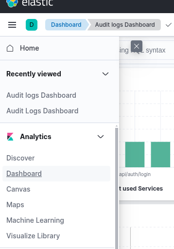
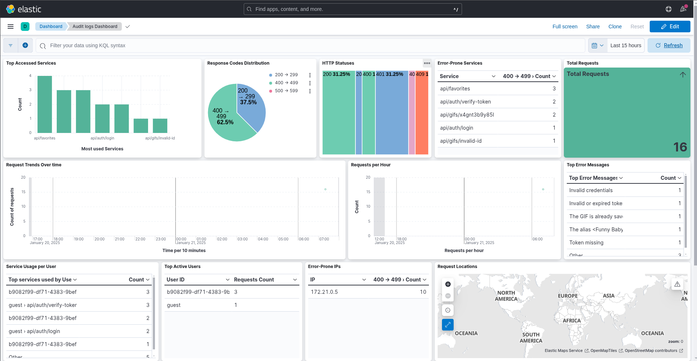
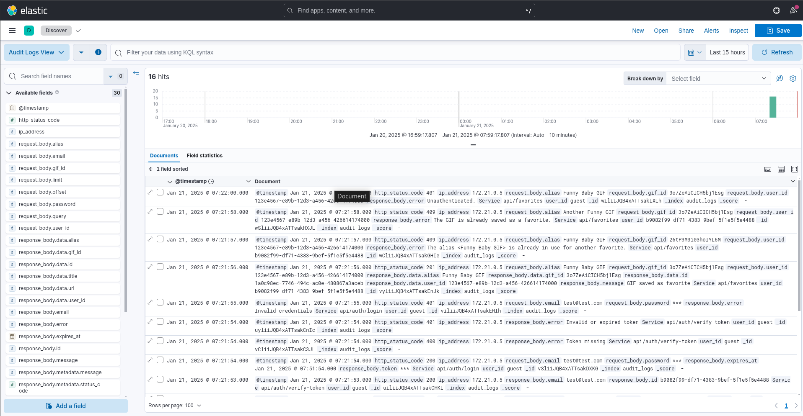
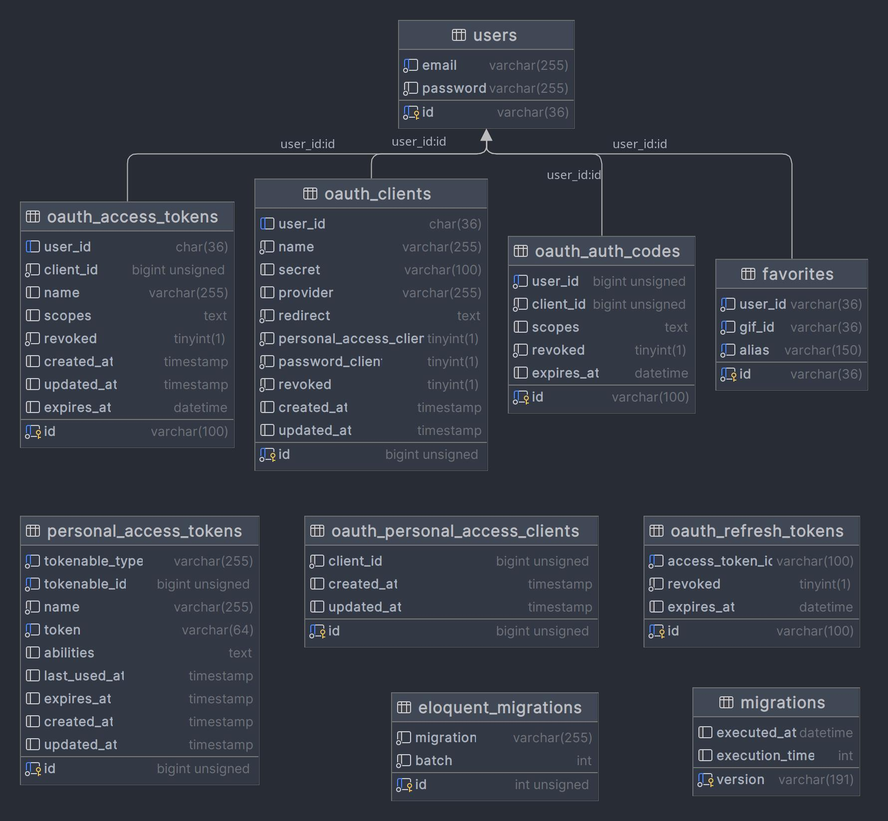

# Laravel 10 Giphy


## 📋 Descripción
Este proyecto está desarrollado en Laravel 10 siguiendo principios de arquitectura hexagonal, aplicando las mejores prácticas de desarrollo como SOLID, DRY, y Tell, Don't Ask. Integra un flujo de trabajo robusto con herramientas modernas para garantizar calidad de código, CI/CD y monitoreo.

## 🚀 Tecnologías y Herramientas
- Laravel 10
- Docker
- Arquitectura Hexagonal
- Doctrine ORM con patrón Repository
- Elasticsearch con Kibana
- ECS (Easy Coding Standard), PSALM, PHPStan, PHPUnit, PHPMD, PHPAT
- GrumPHP para proteger los commits
- Behat para tests de aceptación
- PHPUnit para tests de integración y unitarios
- Passport para OAuth2

## 📂 Estructura del Proyecto

Dentro de la carpeta `src` se encuentra el Bounded Context `Core`.

Dentro del BC se encontraran los distintos modulos que contendran a su vez las distintas capas de la aplicacion.

La arquitectura hexagonal organiza el código en capas claramente separadas:

- **Domain**: Contiene la lógica de negocio.
- **Application**: Implementa casos de uso y orquesta la interacción entre capas.
- **Infrastructure**: Gestiona I/O: frameworks, librerías, y conexiones externas (DB, API, etc.).

La carpeta `Shared` se utiliza para elementos compartidos entre distintos contextos, modulos o capas.

## 🛠️ Requisitos Previos
- Docker y Docker Compose instalados.
- Make instalado en el sistema.
- Navegador para acceder a Kibana.

## 🏗️ Levantar el Proyecto
Usa los siguientes comandos para gestionar el entorno:

```bash
help                 Print this help
composer-install     Install composer dependencies
start                Start the containers
fresh-start          Start the container for first time
stop                 Stop the containers
destroy              Delete the containers, networks and volumes
build                Rebuild the containers from scratch
static-analysis      Runs static code analysis to check for errors, architecture violations, and code quality issues.
mess-detector        Checks code for dirty code
lint                 Runs the linter to check for code style violations
ping-mysql           Ping the mysql service
clean-cache          Clean app cache
shell                Enter shell php container
```

### Primer Inicio

```bash
make fresh-start
```
Esto ejecutará los siguientes pasos automáticamente:
- Construir los contenedores de Docker (incluyendo Laravel, MySQL, Wiremock, Elasticsearch y Kibana).
- Instalar las dependencias con Composer.
- Configurar las bases de datos y migrar las tablas.

## ✅ Calidad de Código
Este proyecto utiliza herramientas avanzadas para garantizar calidad y consistencia del código:

- **ECS (Easy Coding Standard)**: Asegura el cumplimiento de estándares de código.
- **Psalm y Phpmd**: Análisis estático del código.
- **PHPAT**: Pruebas de arquitectura para verificar la adherencia a la arquitectura hexagonal (regla de dependencia).
- **GrumPHP**: Protege los commits ejecutando las herramientas antes mencionadas previo aceptar cambios.

Ejecutar análisis:
```bash
make static-analysis   # Análisis estático y de arquitectura
make mess-detector     # Detectar código "sucio"
make lint              # Verificar el estilo de código
make test-architecture # Verifica la infrastructura
```

## 🧪 Testing
- **Tests de Aceptación**: Utilizando Behat, para verificar casos de uso completos desde la perspectiva del usuario.
- **Tests Unitarios**: Enfocados en la capa de Aplicación con PHPUnit.
- **Tests de Integración**: Verifican la interacción entre capas y dependencias externas.

Los mocks de la API de Giphy se realizan con Wiremock para simular el entorno lo mas similar posible.

Ejecutar todos los tests:
```bash
make test
```

Los tests generaran trafico de ejemplo el cual sera loggeado en Elasticsearch y podra ser visualizado en Kibana.

## 🔒 Protección de Commits
Este proyecto utiliza GrumPHP para proteger el flujo de commits. Antes de permitir un commit, se ejecutan:
- Linters con ECS.
- Análisis estático con PHPStan y Phpmd.
- Pruebas unitarias y de integracion con PHPUnit.
- Validación de estándares de arquitectura con PHPAT.

## 📊 Auditoria
El sistema cuenta con auditoria de requests configurado a través de Elasticsearch y Kibana.

Acceso a las herramientas de logs y visualizacion:
- Elasticsearch: [http://localhost:9200/audit_logs/_search](http://localhost:9200/audit_logs/_search)
- Kibana (para el dashboard de Auditoria): [http://localhost:5601](http://localhost:5601)
  1. Ir al menu izquierdo (burger)
  2. Presionar "Dashboard" o "Audit logs Dashboard"
  3. Abrir el dashboard de auditoria
  
  


### Métricas disponibles
- Métricas de aplicación (tasa de errores, servicios, respuestas HTTP, etc.).
- Logs estructurados en Elasticsearch.

#### Dashboard


#### Logs


## 📝 Diagrama Entidad-Relacion (DER)

La tabla `migrations` es gestionada por Doctrine ORM y gobierna las siguientes tablas:

La entidad `users` pertenece al modulo de Usuarios.

La entidad `favorites` pertenece al modulo de Favoritos.

La entidad `eloquent_migrations` es gestionada por Eloquent y gobierna las siguientes tablas con Passport/OAuth2:
- oauth_access_tokens
- oauth_clients
- oauth_auth_codes
- oauth_personal_access_clients
- oauth_refresh_tokens
- personal_access_tokens



## 🧹 Mantenimiento
Limpiar contenedores y datos:
```bash
make clean-cache
```
Actualizar dependencias:
```bash
make composer-install
```

## 💡 Mejoras Futuras
- **Integrar el patrón Criteria/Specification**:
  Permite definir reglas de filtrado reutilizables y combinar criterios para consultas más limpias y flexibles.
- **Implementar Object Mothers para los tests**: Facilitan la creación de objetos complejos para pruebas reduciendo el codigo duplicado.
- **Integrar herramientas de observabilidad adicionales (e.g., Prometheus/Sentry/New Relic)**.
- **Extender cobertura de tests de aceptación, integracion y unitarios**.
- **Implementar xDebug para debug y profiling**.


## 📝 Licencia
Este proyecto está licenciado bajo MIT.
